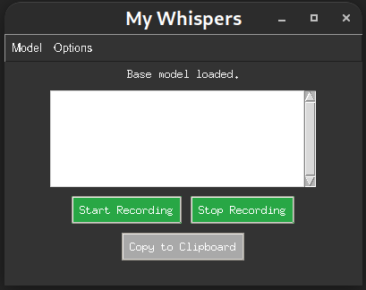

# My Whispers

## An Application for Transcribing Audio Using OpenAI's Whisper Model In Real-Time and In Local Machine

<p align="center">
    
</p>

This is a transcription application that uses OpenAI's Whisper model to transcribe audio recordings. The application provides a graphical user interface (GUI) for recording audio, transcribing it, and copying the transcribed text to the clipboard.

## Motivation

Honestly, there wasn’t some grand reason behind this project. I just wanted a handy local tool for those lazy days when I'm working on my Debian-based system and can't be bothered to type. Also, not a fan of some of sketchy online transcription services!

## Features

- Record audio from the microphone
- Detect speech using WebRTC VAD and stop recording when there is no speech detected
- Transcribe audio using Whisper models
- Display transcribed text in a text area
- Copy transcribed text to the clipboard
- Toggle "Always on Top" window option
- Model selection option(tiny, small, medium, large, turbo)

## Requirements

The application requires the following dependencies:

- Python 3.10
- OpenAI Whisper
- PyAudio 
- Pyperclip
- WebRTC VAD
- Tkinter

You can install the required dependencies using the `requirements.yml` file.

## Installation
- make sure you have portaudio installed on your system (sudo apt install portaudio19-dev).

1. Clone the repository:

   ```sh
   git clone https://github.com/aradar46/My_Whispers.git
   cd My_Whispers
   ```
2. Create a conda environment and install dependencies:

   ```sh
   conda env create -f requirements.yml
   conda activate my_whispers
   ```

## Usage

1. Run the application:

   ```sh
   python3 my_whispers_app.py
   ```
2. Use the GUI to start recording, stop recording, and transcribe audio.
3. In the first run, you need to select the model you want to use. You can select the model from the dropdown menu and it will be downloaded automatically and can be used in the next runs.

## File Structure

- `whisper_app.py`: Main application file containing the GUI and logic for recording and transcribing audio.
- `requirements.yml`: File containing the list of dependencies required for the application.

## Acknowledgements

This project uses the [OpenAI Whisper](https://github.com/openai/whisper) model for transcription. Special thanks to the OpenAI team for their work on the Whisper project.

## License

This project is licensed under the MIT License.
